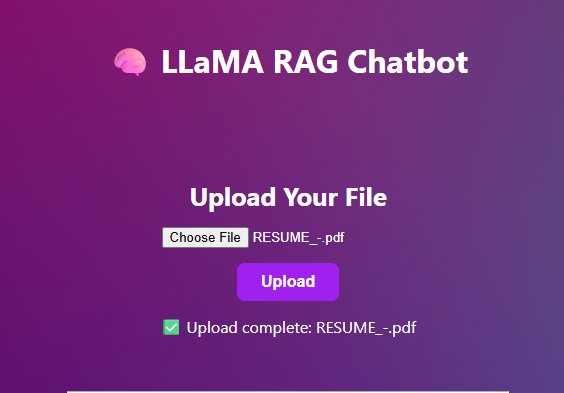
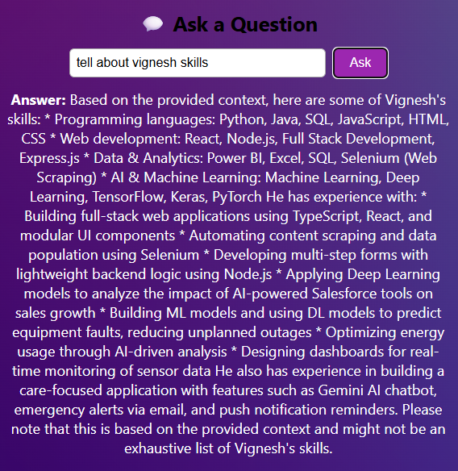

# 🧠 LLaMA RAG Chatbot

A full-stack AI chatbot that allows users to:

- ✅ Upload multiple PDF or text documents  
- ❓ Ask questions related to those documents (RAG-based answers)  
- 💬 Ask general questions answered by the LLaMA model (via Ollama)

Built using **FastAPI** (backend) and **React** (frontend), integrated with **Ollama**, **LangChain**, and **FAISS** for retrieval-augmented generation.

---

## 🚀 Features

- 🗂️ Upload multiple documents (PDF / TXT)
- 📚 Vector-based semantic search using FAISS
- 💡 RAG-powered Q&A from uploaded documents
- 🌐 General LLM response fallback
- 🎨 Stylish, responsive UI
- 🔥 Single-command launch for frontend & backend

---

## 🧱 Tech Stack

- **Frontend**: React, HTML/CSS
- **Backend**: FastAPI, Python
- **Vector DB**: FAISS
- **LLM + Embeddings**: Ollama (LLaMA 3)
- **Document Parsing**: PyMuPDF
- **Embeddings/Chain**: LangChain
- **Multi-process Launcher**: Concurrently (Node)

---

## 📦 Requirements

### ✅ Backend (Python)

Install in a virtual environment:

```bash
pip install fastapi uvicorn langchain faiss-cpu ollama PyMuPDF pydantic python-multipart
```

### ✅ Frontend (Node)

```bash
npm install
```

### ✅ Multi-process runner

From the project root:

```bash
npm init -y
npm install concurrently
```

---

## 📁 Project Structure

```
llama-rag-chatbot/
├── backend/
│   ├── main.py
│   ├── document_handler.py
│   └── ...
├── frontend/
│   ├── src/
│   ├── public/
│   └── ...
├── vector_store/
├── package.json
└── README.md
```

---

## 🔧 Scripts (`package.json`)

```json
"scripts": {
  "start": "concurrently \"npm run server\" \"npm run client\"",
  "server": "cd backend && venv\\Scripts\\activate && uvicorn main:app --reload",
  "client": "cd frontend && npm start"
}
```

> 💡 On Linux/Mac:
```json
"server": "cd backend && source venv/bin/activate && uvicorn main:app --reload"
```

---

## 🧪 How to Run (Single Command)

From the root folder:

```bash
npm start
```

This will:

* ⏩ Start the FastAPI backend with `uvicorn`
* ⏩ Launch the React frontend
* ⚙️ Connect both seamlessly for local development

---

## 📸 Demo

> Add your screenshots in a `screenshots/` folder if you'd like.

Example:

  


---

## 📄 License

MIT – Use freely, but attribution appreciated.

---

## 🙋‍♂️ Author

Made with ❤️ by **Vignesh R.S**
